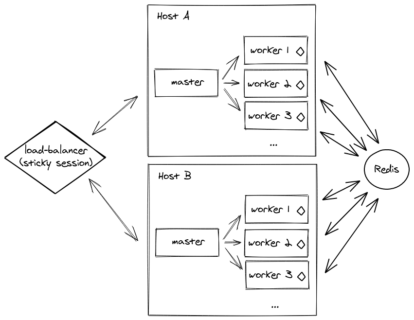

# Sticky sessions for Socket.IO

A simple and performant way to use [Socket.IO](https://socket.io/) within a [cluster](http://nodejs.org/docs/latest/api/cluster.html).

Unlike other packages like [sticky-session](https://github.com/indutny/sticky-session), the routing is based on the session ID (the `sid` query parameter).


See also:

- [sticky-session](https://github.com/indutny/sticky-session) (routing based on `connection.remoteAddress`)
- [socketio-sticky-session](https://github.com/wzrdtales/socket-io-sticky-session) (routing based on the `x-forwarded-for` header)

**Table of contents**

- [Installation](#installation)
- [Usage](#usage)
- [How it works](#how-it-works)
- [Notes](#notes)
- [License](#license)

## Installation

```
npm install @socket.io/sticky
```

## Usage

```js
const cluster = require("cluster");
const http = require("http");
const { Server } = require("socket.io");
const numCPUs = require("os").cpus().length;
const { setupMaster, setupWorker } = require("@socket.io/sticky");
const { createAdapter, setupPrimary } = require("@socket.io/cluster-adapter");

if (cluster.isMaster) {
  console.log(`Master ${process.pid} is running`);

  const httpServer = http.createServer();

  setupMaster(httpServer, {
    loadBalancingMethod: "least-connection", // either "random", "round-robin" or "least-connection"
  });

  setupPrimary();

  httpServer.listen(3000);

  for (let i = 0; i < numCPUs; i++) {
    cluster.fork();
  }

  cluster.on("exit", (worker) => {
    console.log(`Worker ${worker.process.pid} died`);
    cluster.fork();
  });
} else {
  console.log(`Worker ${process.pid} started`);

  const httpServer = http.createServer();
  const io = new Server(httpServer);
  io.adapter(createAdapter());
  setupWorker(io);

  io.on("connection", (socket) => {
    /* ... */
  });
}
```

## How it works

The first HTTP request (without `sid` query parameter) is forwarded to a random worker (based on the `loadBalancingMethod` option).

The underlying Engine.IO server creates a new session and emits a `connection` event with the session ID. The worker sends this session ID to the master, which stores the relationship between the worker ID and the session ID.

For subsequent requests, the `sid` query parameter is extracted by the master process, which then forwards the handle to the right worker.

## Notes

- this package is not needed if you only use WebSockets (which might be a sensible choice as of 2021)

```js
// client-side
const socket = io({
  transports: ["websocket"] // HTTP long-polling is disabled
});
```

- in a multi-server setup, you will need to use another adapter, like the [Redis adapter](https://socket.io/docs/v4/redis-adapter/)



- this module is not compatible with an HTTPS server

For more information, please see [this issue](https://github.com/socketio/socket.io-sticky/issues/3).

## License

MIT
